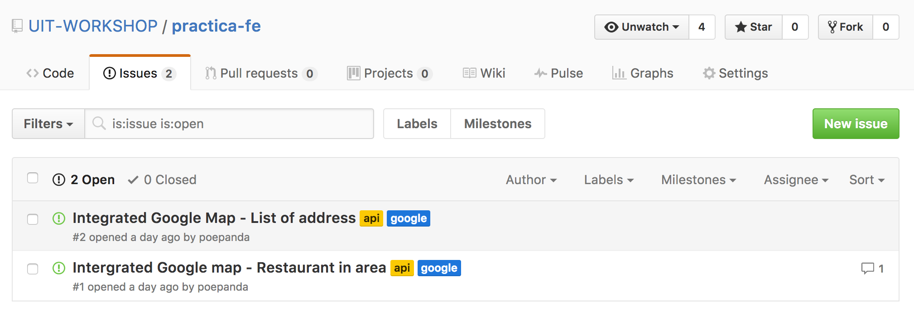
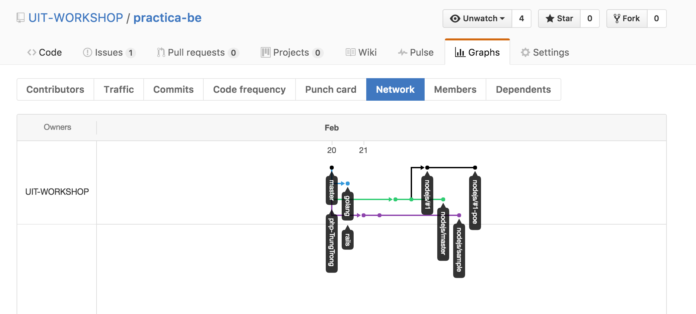
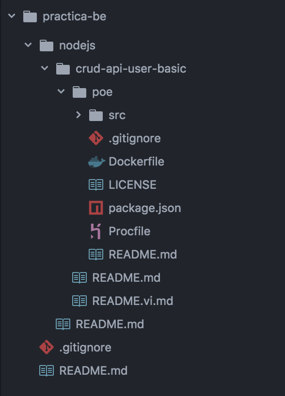

# How to Practica?

## Requirement

:candy: **Knowing Git and Github**

To start working and collaborate to projects/tasks, you need to know about git which is the way we work together and simultaneously.

## Key things when you work on Practica

### :watermelon: Each Practica project have it own repo
For example:
- practica-fe: Web Frontend tasks / practices
- practica-be: Backend tasks / practices

### :lemon: Tasks in each practica is represented by issues
For example, below we have 2 tasks (issues) opened in Frontend Practica, each task is referred by 1 issue.

### :apple: Essential branch structure in each practica repo follow specific formats

:cherries: **Category branch (Master)**: category/master

This branch will contain all the tasks done within this category

For example: api/master

:cherries: **Task branch**: category/#issue-id

To implement a specific task as starting point and will be collection of completed work of that task done by all the team involved.

(Will PR - Pull Request to Category branch after complete)

*For example: api/#1*

:cherries: **Task branch of specific team**: category/#{issue-id}-{team-name}

This branch is created by each team base on task branch to implement the task and collaborate within the team (2-3 members)

*For example: category/#1-teama*

:cherries: **Sample branch**: category/sample

This branch contain all the sample code and also link to starter kit that can be used as references to implement the tasks within according category.

*For example: api/sample*

Below is a diagram of branches that has been create to implement some tasks in Nodejs category in practica-be (Backend)

The correct branch flow should be:
- nodejs/master
  - nodejs/sample
  - nodejs/#1
    - nodejs/#1-poe

### :tangerine: Along with branches, tasks and category will be separated in different folder tree.

The order will be:
Root folder > {category} > {task} > {team}

For example, as below we have a tree of task "Crud api user basic" under practica-be and implemented by poe.

### :tomato: Each folder will have its own README.md

(README.md will be display below directory part when you access that folder on Github)

:book: **Folder root > README.md:** Main mission of that particular Practica

:book: **Forder root > {category} > README.md:** The main idea of this category and also list of available task inside.

:book: **Folder root > {category} > {task}:** The goal and other information which related to the task.

:book: **Folder root > {category} > {task} > {team}:** How to run and some explanation about what have been done by the team according to specific task.
